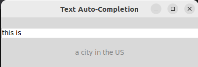

# AutoCompleteApp

AutoCompleteApp is a Python application designed for text auto-completion based on user input. Utilizing a classic Decoder architecture, the application predicts the next words in a sentence, enhancing the user's typing experience. The prediction model is trained on a dataset derived from Wikipedia texts, making it capable of generating relevant and contextual word suggestions.



## Installation

To set up the AutoCompleteApp on your local machine, follow these steps:

1. Clone the repository to your local machine:
  
```bash
git clone https://github.com/yourusername/AutoCompleteApp.git
cd AutoCompleteApp
```

2. Install the required dependencies:

```bash
pip install -r requirements.txt
```

3. Ensure that the model file [`model_long_data.pt`](https://disk.yandex.ru/d/kE3At_bBlx0lHw) is in the project directory.

## Usage

To run the application, use the following command:

```bash
python main.py [optionalwindowsize]
```

- `[optionalwindowsize]` is an integer that specifies the size of the prediction window (default is 5). 


### User Interaction

- **Typing Input**: As you type in the entry field, suggestions appear below based on your text.
- **Tab Key**: Pressing the `Tab` key inserts the suggestion into the text input.
- **Enter Key**: Pressing the `Enter` key clears the input field for a fresh start.